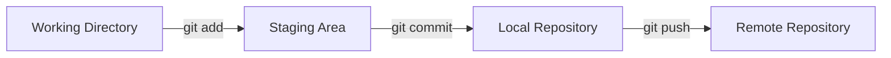

## What is Git?

Git is a **Distributed Version Control System (DVCS)** that helps developers track code changes, collaborate with teams, and manage different versions of a project.

> [!NOTE]  
> Git tracks the history of your code and allows you to revert to previous versions whenever needed.

### Benefits of Git

- Version control
    
- Collaboration
    
- Branching and merging
    
- Rollback capability
    
- Distributed architecture
    
- Fast and lightweight
    

---

# Git Architecture



---

# Git Configuration

## Check Git Installation

```bash
git --version
```

### When to Use?

Verify Git is installed correctly.

---

## Configure Username

```bash
git config --global user.name "Your Name"
```

### When to Use?

Usually once after installing Git.

---

## Configure Email

```bash
git config --global user.email "yourmail@gmail.com"
```

### When to Use?

Associates commits with your identity.

---

## View All Configurations

```bash
git config --list
```

---

## View Specific Configuration

```bash
git config user.name
git config user.email
```

---

# Repository Commands

## Initialize Repository

```bash
git init
```

### What Happens?

Creates a hidden `.git` directory.

### When to Use?

Starting a new project.

---

## Clone Repository

```bash
git clone <repository-url>
```

### Example

```bash
git clone https://github.com/user/project.git
```

### When to Use?

Download an existing repository.

---

# Checking Status

## View Current Status

```bash
git status
```

### Shows

- Current branch
    
- Modified files
    
- Staged files
    
- Untracked files
    

> [!TIP]  
> This is the most frequently used Git command.

---

# Adding Files

## Add Single File

```bash
git add UserController.java
```

---

## Add Multiple Files

```bash
git add file1.java file2.java
```

---

## Add All Files

```bash
git add .
```

### When to Use?

Stage all modified files.

---

# Commit Commands

## Create Commit

```bash
git commit -m "Added login functionality"
```

### Purpose

Stores a snapshot of staged changes.

---

## Commit Tracked Files Directly

```bash
git commit -am "Fixed login bug"
```

> [!WARNING]  
> Does not include newly created files.

---

## Modify Last Commit Message

```bash
git commit --amend -m "Updated commit message"
```

---

# Viewing History

## Full Commit History

```bash
git log
```

---

## Compact History

```bash
git log --oneline
```

Example:

```text
7d89a4 Added Login API
2e81bc Fixed Bug
```

---

## Graph View

```bash
git log --oneline --graph --all
```

Example:

```text
* 1a2b3c Feature Completed
|\
| * 4d5e6f Bug Fix
|/
* 7g8h9i Initial Commit
```

---

# Branching

## Why Branches?

Branches allow multiple developers to work independently without affecting production code.

---

## View Branches

```bash
git branch
```

Current branch is marked with:

```text
* main
```

---

## Create Branch

```bash
git branch feature-login
```

---

## Switch Branch

```bash
git checkout feature-login
```

Modern command:

```bash
git switch feature-login
```

---

## Create and Switch

```bash
git checkout -b feature-login
```

Modern:

```bash
git switch -c feature-login
```

---

## Rename Branch

```bash
git branch -m old-name new-name
```

---

## Delete Branch

```bash
git branch -d feature-login
```

Force delete:

```bash
git branch -D feature-login
```

---

# Merging

## Merge Branch

```bash
git checkout main
git merge feature-login
```

### What Happens?

Combines feature branch into main branch.

---

## Merge Conflict

Occurs when Git cannot decide which changes to keep.

Example:

```text
<<<<<<< HEAD
Code from main branch
=======
Code from feature branch
>>>>>>> feature-login
```

### Resolution Steps

1. Open file
    
2. Remove conflict markers
    
3. Keep desired code
    
4. Save file
    
5. Add file
    
6. Commit changes
    

---

# Remote Repository

## View Remote

```bash
git remote -v
```

Example:

```text
origin  https://github.com/user/project.git
```

---

## Add Remote

```bash
git remote add origin <url>
```

---

## Change Remote URL

```bash
git remote set-url origin <url>
```

---

# Push Commands

## First Push

```bash
git push -u origin main
```

### Why -u?

Creates upstream tracking.

After this:

```bash
git push
```

is sufficient.

---

## Push Current Branch

```bash
git push
```

---

## Push Specific Branch

```bash
git push origin feature-login
```

---

## Force Push

```bash
git push --force
```

> [!WARNING]  
> Can overwrite other developers' work.

---

# Pull and Fetch

## Pull Changes

```bash
git pull
```

Internally:

```text
git fetch
git merge
```

---

## Fetch Changes

```bash
git fetch
```

### Difference

|Fetch|Pull|
|---|---|
|Downloads changes|Downloads + merges|
|Safe|May create conflicts|
|Review first|Merge immediately|

---

# Git Stash

## Save Current Work

```bash
git stash
```

---

## Save With Message

```bash
git stash push -m "Working on login screen"
```

---

## View Stashes

```bash
git stash list
```

---

## Apply Stash

```bash
git stash apply
```

---

## Apply and Remove

```bash
git stash pop
```

---

# Undo Changes

## Unstage File

```bash
git restore --staged User.java
```

---

## Discard Local Changes

```bash
git restore User.java
```

> [!WARNING]  
> Changes cannot be recovered.

---

# Reset

## Undo Last Commit (Keep Changes)

```bash
git reset --soft HEAD~1
```

---

## Undo Last Commit (Keep Files)

```bash
git reset --mixed HEAD~1
```

---

## Delete Commit Completely

```bash
git reset --hard HEAD~1
```

> [!WARNING]  
> Permanently removes changes.

---

# Revert

## Revert Commit

```bash
git revert <commit-id>
```

### Production Usage

Preferred because history remains intact.

---

# Reset vs Revert

|Reset|Revert|
|---|---|
|Rewrites history|Preserves history|
|Risky|Safe|
|Local branch|Shared branch|

---

# Git Diff

## View Unstaged Changes

```bash
git diff
```

---

## View Staged Changes

```bash
git diff --staged
```

---

## Compare Commits

```bash
git diff commit1 commit2
```

---

# Tags

## Create Tag

```bash
git tag v1.0
```

---

## Annotated Tag

```bash
git tag -a v1.0 -m "Release Version 1.0"
```

---

## View Tags

```bash
git tag
```

---

## Push Tags

```bash
git push origin --tags
```

---

# Rebase

## Rebase Branch

```bash
git rebase main
```

### Benefit

Cleaner history than merge.

---

## Continue Rebase

```bash
git rebase --continue
```

---

## Abort Rebase

```bash
git rebase --abort
```

---

# Cherry Pick

## Copy Specific Commit

```bash
git cherry-pick <commit-id>
```

### Use Case

Move one commit from one branch to another.

---

# Git Ignore

## Example .gitignore

```gitignore
target/
.idea/
.vscode/
*.class
*.log
.env
node_modules/
```

### Why?

Prevents unnecessary files from being committed.

---

# Most Used Commands Daily

```bash
git status
git add .
git commit -m "message"
git pull
git push
git stash
git stash pop
git branch
git switch branch-name
git log --oneline
```

---

# Real Project Workflow

## Step 1: Get Latest Code

```bash
git pull
```

---

## Step 2: Create Feature Branch

```bash
git switch -c feature-login
```

---

## Step 3: Develop

```bash
git add .
git commit -m "Added Login API"
```

---

## Step 4: Push Branch

```bash
git push origin feature-login
```

---

## Step 5: Sync with Main

```bash
git checkout main
git pull

git checkout feature-login
git rebase main
```

---

## Step 6: Create Pull Request

```text
feature-login → main
```

---

# Interview Questions

### What is Git?

Distributed Version Control System.

### What is HEAD?

Pointer to the latest commit of the current branch.

### What is Staging Area?

Temporary area between Working Directory and Commit.

### Difference Between Git and GitHub?

|Git|GitHub|
|---|---|
|Version control tool|Hosting platform|
|Local system|Cloud platform|

### Merge vs Rebase?

|Merge|Rebase|
|---|---|
|Preserves history|Cleaner history|
|Extra merge commit|No merge commit|

### Fetch vs Pull?

|Fetch|Pull|
|---|---|
|Download only|Download + Merge|

### What is Git Stash?

Temporary storage for unfinished work.

### What is Cherry Pick?

Copy a specific commit to another branch.

### What is Upstream Branch?

Default remote branch connected to a local branch.

---

# Quick Revision Sheet

```bash
git status
git add .
git commit -m "message"
git push
git pull
git branch
git switch -c branch-name
git merge branch-name
git rebase main
git stash
git stash pop
git log --oneline
git revert commit-id
git reset --soft HEAD~1
```

> [!SUCCESS]  
> If you master the commands in this document, you'll comfortably handle 95% of Git operations used in real-world Spring Boot, React, and enterprise projects.